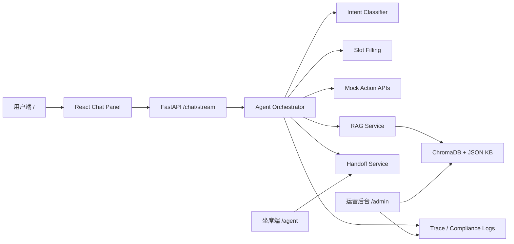

# 晓晓 AI 智能客服技术文档

版本：v1.0  
日期：2026-06-26  
项目路径：`/Users/zhuzixuan/Desktop/晓晓AI`

## 1. 技术概览

晓晓 AI 智能客服采用前后端分离架构：

- 前端：React + Vite + Tailwind CSS，负责用户聊天、结构化卡片、坐席端和运营后台。
- 后端：Python FastAPI，负责 Agent 主控流程、LLM 意图分类、业务工具调用、RAG、防幻觉、合规日志和运营接口。
- 知识库：JSON 原始知识库 + ChromaDB 本地向量库 + sentence-transformers 嵌入模型。
- 数据存储：JSONL 日志兼容层 + SQLite 轻量数据层。
- 模型接口：OpenAI-compatible 格式，可接 DeepSeek、OpenAI 或其他兼容服务。

## 2. 目录结构

```text
晓晓AI/
├── MASTER_PRD.md
├── README.md
├── evaluator.py
├── UAT_Evaluation_Report.md
├── septwolves_kb.json/
├── backend/
│   ├── app/
│   │   ├── main.py
│   │   ├── routers/
│   │   ├── services/
│   │   ├── models/
│   │   └── dependencies/
│   ├── data/
│   ├── scripts/
│   ├── tests/
│   └── requirements.txt
├── frontend/
│   ├── src/
│   │   ├── main.jsx
│   │   └── styles.css
│   ├── public/
│   └── package.json
└── docs/
    ├── PRODUCT_REQUIREMENTS_DOCUMENT.md
    └── TECHNICAL_DOCUMENTATION.md
```

## 3. 系统架构



核心设计原则：

- 用户端只展示聊天体验。
- 坐席端和后台端只面向内部人员。
- 所有 AI 输出都经过路由、槽位、工具或 RAG 约束。
- 无依据、高危、连续低置信度时优先转人工。

## 4. 前端实现

### 4.1 技术栈

| 模块 | 技术 |
| --- | --- |
| 框架 | React 19 |
| 构建 | Vite |
| 样式 | Tailwind CSS |
| 图标 | lucide-react |
| 接口通信 | fetch + NDJSON streaming |

### 4.2 页面路由

前端当前使用单入口 React 应用，根据浏览器路径渲染不同页面：

| 路径 | 页面 | 说明 |
| --- | --- | --- |
| `/` | 用户端聊天页 | 公开入口 |
| `/agent` | 人工坐席工作台 | 内部入口 |
| `/admin` | 运营管理后台 | 内部入口 |

生产部署建议：

- 二维码只指向 `/`。
- `/agent` 和 `/admin` 开启内部令牌校验。
- `VITE_ENABLE_PORTFOLIO_PAGES` 在真实产品部署时保持 `false`。

### 4.3 流式聊天协议

前端请求：

```http
POST /chat/stream
Content-Type: application/json

{
  "session_id": "session-001",
  "message": "查物流 202606160001"
}
```

后端返回 `application/x-ndjson`，每行是一个 JSON 对象。

```json
{"type":"status","content":"正在识别意图"}
{"type":"status","content":"正在查询订单状态"}
{"type":"token","content":"我查到了"}
{"type":"card","card":{"type":"order_status"}}
{"type":"done","trace_id":"...","elapsed_ms":123.45}
```

前端根据 `type` 字段分别处理状态、文本、卡片和完成事件。

### 4.4 卡片类型

| card.type | 用途 |
| --- | --- |
| `quick_actions` | 意图澄清和快捷操作 |
| `order_selector` | 缺订单号时选择订单 |
| `order_status` | 订单物流状态 |
| `refund_result` | 退款受理结果 |
| `address_update` | 地址修改结果 |
| `urge_result` | 催发货回执 |
| `rag_context` | 知识库召回依据 |
| `handoff` | 转人工通道 |
| `slot_prompt` | 退款原因、新地址等槽位追问 |

## 5. 后端实现

### 5.1 技术栈

| 模块 | 技术 |
| --- | --- |
| Web 框架 | FastAPI |
| 异步客户端 | httpx |
| 数据校验 | Pydantic |
| 向量库 | ChromaDB |
| Embedding | sentence-transformers |
| 测试 | pytest |
| 本地数据 | JSONL + SQLite |

### 5.2 FastAPI 路由

| 路由模块 | Prefix | 说明 |
| --- | --- | --- |
| `chat.py` | `/chat/stream` | 聊天主入口 |
| `actions.py` | `/api/actions` | 四个业务工具 |
| `session.py` | `/api/session` | 会话初始化 |
| `kb.py` | `/api/kb` | 知识库治理和召回预览 |
| `handoff.py` | `/api/handoff` | 人工工单 |
| `compliance.py` | `/api/compliance` | 合规偏好和负反馈 |
| `ops.py` | `/api/ops` | 运营看板和链路追踪 |

### 5.3 Agent 主控流程

核心入口：`backend/app/services/orchestrator.py`

处理流程：

1. 接收用户消息。
2. 调用意图分类器。
3. 若命中高危，直接转人工。
4. 若低置信度，返回澄清卡片；连续 3 次低置信度则转人工。
5. 若为知识咨询，进入 RAG。
6. 若为查询/操作，检查必要槽位。
7. 槽位缺失则返回订单选择或追问卡片。
8. 槽位齐备后调用业务工具。
9. 返回自然语言文本和结构化卡片。
10. 写入 trace、合规或转人工日志。

## 6. 意图分类模块

核心文件：`backend/app/services/intent_classifier.py`

分类结果结构：

```json
{
  "category": "query_operation",
  "action": "QueryOrderStatus",
  "confidence": 0.96,
  "parameters": {
    "order_id": "202606160001"
  },
  "reason": "用户明确要求查询订单物流状态",
  "source": "llm"
}
```

支持三类路由：

| category | 含义 | 后续流程 |
| --- | --- | --- |
| `query_operation` | 查询/操作类 | 槽位填充 + 工具调用 |
| `knowledge_consultation` | 知识/咨询类 | RAG |
| `chat_high_risk` | 闲聊/高危类 | 转人工 |

分类器实现：

- 有 `LLM_API_KEY` 或 `OPENAI_API_KEY` 时，调用 OpenAI-compatible API。
- 无密钥时，使用本地关键词模拟分类。
- LLM 超时或报错时，降级到关键词规则。
- 对高危关键词前置兜底，确保敏感风险优先处理。

## 7. 业务工具模块

核心文件：`backend/app/services/mock_actions.py`

当前 Mock 订单围绕七匹狼业务域构造：

| order_id | 商品 | 状态 | 渠道 |
| --- | --- | --- | --- |
| `202606160001` | 七匹狼商务通勤夹克 | 运输中 | 七匹狼官方旗舰店 |
| `202606160002` | 七匹狼凉感抗皱休闲西裤 | 待发货 | 七匹狼直播间 |
| `202606160003` | 七匹狼新疆长绒棉短袖衬衫 | 已签收 | 七匹狼官方商城 |

四个核心工具：

| 工具 | 输入 | 输出 |
| --- | --- | --- |
| `QueryOrderStatus` | `order_id` | 发货状态、快递公司、单号 |
| `ApplyRefund` | `order_id`, `reason` | 受理结果、预计到账时间 |
| `UpdateAddress` | `order_id`, `new_address` | 是否成功、拦截提示 |
| `UrgeLogistics` | `order_id` | 催办回执 |

## 8. RAG 与防幻觉

核心文件：

- `backend/app/services/rag.py`
- `backend/scripts/build_kb_index.py`
- `septwolves_kb.json/`

RAG 流程：

1. 读取七匹狼知识库 JSON。
2. 提取 content 和 metadata。
3. 使用 sentence-transformers 生成 embedding。
4. 写入本地 ChromaDB。
5. 用户咨询进入混合检索。
6. 检索结果经过业务词 rerank。
7. 判断召回内容是否能支撑回答。
8. 有依据则生成回答。
9. 无依据则输出固定兜底话术并转人工。

防幻觉 System Prompt 约束：

- 只能基于 `<context>` 回答。
- 上下文没有对应信息时，必须输出固定兜底话术。
- 禁止自主承诺包邮、全额退款、赔偿等权益。
- 禁止补充知识库以外的品牌政策或活动规则。

固定兜底话术：

```text
抱歉，目前系统暂未查阅到该商品的具体活动规则，我马上为您转接人工客服核实。
```

## 9. 数据与日志

### 9.1 JSONL 日志

| 文件 | 说明 |
| --- | --- |
| `backend/data/trace_events.jsonl` | 聊天链路追踪 |
| `backend/data/handoff_events.jsonl` | 转人工工单 |
| `backend/data/compliance_events.jsonl` | 合规偏好和负反馈 |

### 9.2 SQLite

初始化：

```bash
cd backend
python scripts/init_sqlite.py --import-jsonl
```

SQLite 用于保存聊天链路、合规反馈和人工工单事件，同时保留 JSONL 兼容。

## 10. 环境变量

后端常用变量：

| 变量 | 说明 |
| --- | --- |
| `LLM_API_KEY` | 真实模型服务密钥 |
| `OPENAI_API_KEY` | 可选别名 |
| `LLM_BASE_URL` | OpenAI-compatible API 地址 |
| `LLM_MODEL` | 聊天模型名称 |
| `LLM_INTENT_TIMEOUT_SECONDS` | 意图分类超时阈值 |
| `LLM_RAG_TIMEOUT_SECONDS` | RAG 生成超时阈值 |
| `KB_JSON_PATH` | 知识库 JSON 路径 |
| `KB_CHROMA_DIR` | ChromaDB 持久化目录 |
| `ADMIN_API_TOKEN` | 内部后台访问令牌 |
| `CORS_ALLOWED_ORIGINS` | 允许访问后端的前端域名 |

前端常用变量：

| 变量 | 说明 |
| --- | --- |
| `VITE_API_BASE_URL` | 后端 API 地址 |
| `VITE_REQUIRE_INTERNAL_TOKEN` | 是否要求内部令牌 |
| `VITE_ENABLE_PORTFOLIO_PAGES` | 是否开启作品集演示页 |

DeepSeek 接入示例：

```bash
LLM_BASE_URL=https://api.deepseek.com/v1
LLM_MODEL=deepseek-chat
LLM_API_KEY=你的密钥
```

不要把真实密钥提交到代码仓库。

## 11. 本地启动

### 11.1 后端

```bash
cd /Users/zhuzixuan/Desktop/晓晓AI/backend
python -m venv .venv
source .venv/bin/activate
pip install -r requirements.txt
python scripts/init_sqlite.py --import-jsonl
python scripts/build_kb_index.py
uvicorn app.main:app --reload --port 8000
```

后端文档：

```text
http://localhost:8000/docs
```

### 11.2 前端

```bash
cd /Users/zhuzixuan/Desktop/晓晓AI/frontend
npm install
npm run dev
```

本地访问：

```text
http://localhost:5173/
```

## 12. Docker 启动

```bash
cd /Users/zhuzixuan/Desktop/晓晓AI
cp .env.example .env
docker compose up --build
```

访问地址：

| 服务 | 地址 |
| --- | --- |
| 用户端 | `http://localhost:5173/` |
| 坐席端 | `http://localhost:5173/agent` |
| 管理后台 | `http://localhost:5173/admin` |
| 后端文档 | `http://localhost:8000/docs` |

## 13. 测试与验收

### 13.1 后端测试

```bash
cd /Users/zhuzixuan/Desktop/晓晓AI/backend
source .venv/bin/activate
python -m pytest tests
```

### 13.2 前端构建

```bash
cd /Users/zhuzixuan/Desktop/晓晓AI/frontend
npm run build
```

### 13.3 UAT 自动跑分

```bash
cd /Users/zhuzixuan/Desktop/晓晓AI
python evaluator.py
```

输出：

```text
UAT_Evaluation_Report.md
```

验收指标：

| 指标 | 标准 |
| --- | --- |
| TTFT | < 800ms |
| 意图分类准确率 | >= 92% |
| 高危拦截率 | 100% |
| 幻觉率 | < 0.5% |

## 14. 公网部署建议

推荐结构：

| 模块 | 推荐平台 |
| --- | --- |
| 前端 | Vercel / Netlify / Cloudflare Pages |
| 后端 | Render / Railway / Fly.io / 云服务器 |
| 数据库 | SQLite 起步，后续 PostgreSQL |
| 向量库 | 本地 Chroma 起步，后续托管向量库 |

部署注意：

- 前端生产环境配置 `VITE_API_BASE_URL` 为后端公网地址。
- 后端配置 `CORS_ALLOWED_ORIGINS` 为前端公网域名。
- 后端必须配置 `ADMIN_API_TOKEN`。
- 用户二维码只放 `/`。
- 不要公开 `/admin` 和 `/agent` 的访问令牌。

## 15. 安全与合规

- 密钥只放 `.env` 或云平台环境变量。
- 生产环境禁止把真实 API key 写入源码。
- 后台接口通过 `X-Admin-Token` 校验。
- 用户端展示个性化标签拒绝权和负反馈入口。
- 高危内容直接转人工并记录审计日志。
- 防幻觉兜底不允许模型输出未被知识库支持的承诺。

## 16. 运维检查清单

上线或演示前建议检查：

- `/health` 返回 `{"status":"ok"}`。
- `/chat/stream` 可以正常流式返回。
- 用户端 `/` 能正常聊天。
- `/admin` 和 `/agent` 未授权时不可查看内部信息。
- “七匹狼衬衫怎么洗”能命中知识库。
- “免费送皮带”等无依据问题会转人工。
- 高危敏感词会转人工。
- `python evaluator.py` 可以生成验收报告。

## 17. 后续技术规划

| 阶段 | 技术优化 |
| --- | --- |
| v1.1 | 完善真实 LLM 接入、模型健康监控、超时重试 |
| v1.2 | 将 SQLite 升级为 PostgreSQL，补充数据迁移脚本 |
| v1.3 | 接入真实订单、物流、退款和客服工单系统 |
| v1.4 | 建立知识库发布、审核、回滚、命中分析流程 |
| v1.5 | 增加用户权限、坐席权限、管理员权限和审计后台 |
| v1.6 | 引入生产监控、错误告警、灰度发布和 A/B 测试 |

