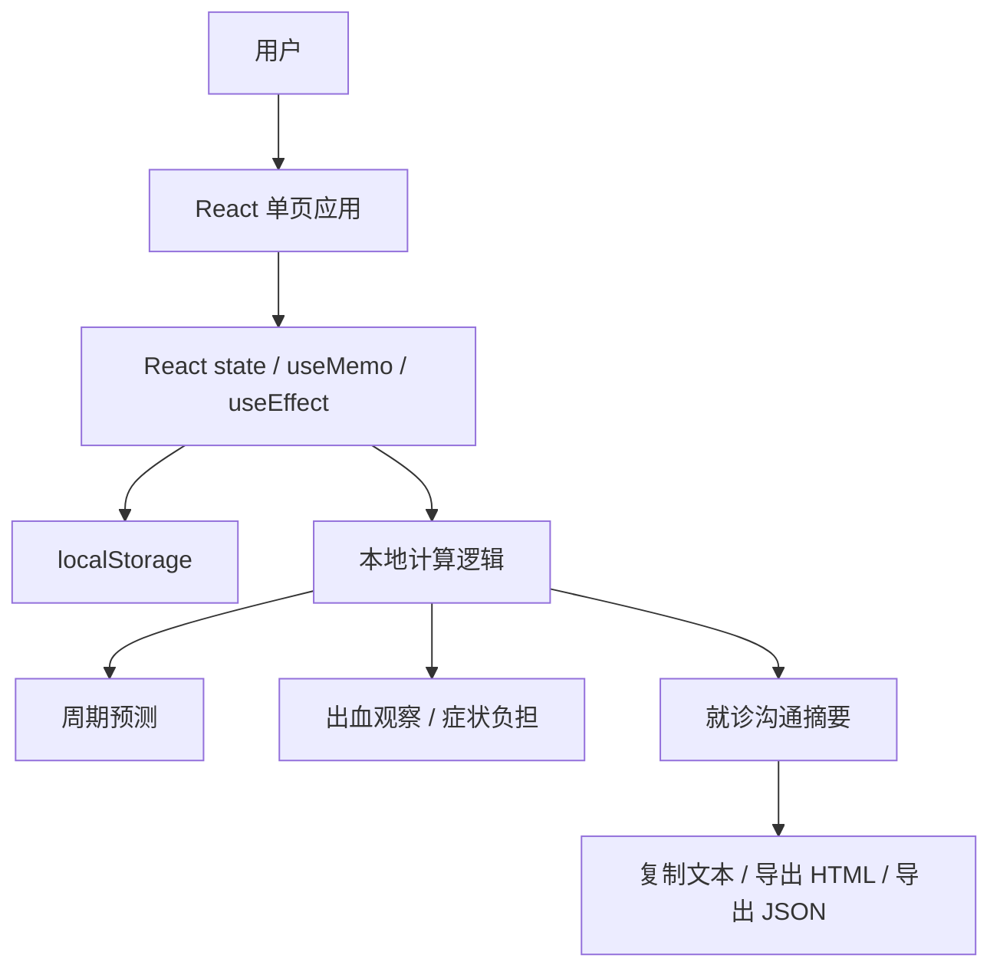

# 月信技术文档

## 1. 文档信息

- 项目名称：月信
- 当前版本：P 版 MVP
- 文档日期：2026-06-26
- 当前形态：前端可交互原型
- 运行方式：本地 Web App
- 技术栈：React 19、TypeScript、Vite、lucide-react、CSS

## 2. 项目概览

月信当前是一个无后端、无账号、无云同步的前端原型。所有健康记录和设置都保存在用户当前浏览器的 localStorage 中。该架构适合 P 版验证隐私优先定位、核心交互闭环和就诊摘要价值。

当前代码主要集中在：

- `src/App.tsx`：页面、状态、业务逻辑、数据模型、导出逻辑。
- `src/styles.css`：整体视觉、移动端布局、卡片和控件样式。
- `src/main.tsx`：React 入口。
- `package.json`：依赖和运行脚本。

## 3. 本地运行

安装依赖：

```bash
npm install
```

启动开发环境：

```bash
npm run dev
```

默认访问地址：

```text
http://127.0.0.1:5173/
```

生产构建：

```bash
npm run build
```

本地预览构建产物：

```bash
npm run preview
```

## 4. 技术架构

### 4.1 当前架构



### 4.2 架构特点

- 单页应用：底部 Tab 切换首页、记录、洞察、我的。
- 本地优先：数据读写都在浏览器本地完成。
- 无服务端依赖：当前版本不需要接口、数据库、鉴权服务。
- 状态集中：核心状态由 `App` 组件维护并向子组件传递。
- 计算本地化：预测、洞察、摘要全部由前端函数生成。

## 5. 目录结构

```text
月信/
├── index.html
├── package.json
├── README.md
├── PRD.md
├── 月信-产品需求文档.md
├── 月信-技术文档.md
├── src/
│   ├── App.tsx
│   ├── main.tsx
│   └── styles.css
├── portfolio-assets/
│   ├── screenshots/
│   ├── demo/
│   ├── user-flow.png
│   └── user-flow.svg
└── dist/
```

## 6. 核心页面与组件

| 页面 / 组件 | 职责 |
| --- | --- |
| `App` | 顶层状态管理、数据持久化、Tab 路由、弹窗和锁屏控制 |
| `TopBar` | 顶部品牌栏和锁定入口 |
| `HomeScreen` | 首页预测、隐私条、快速记录、出血观察、敏感信息隐藏 |
| `QuickRecordCard` | 20 秒快速记录入口 |
| `RecordScreen` | 日历选日、每日记录表单、复用昨天状态 |
| `CalendarCard` | 月历展示、预测经期、易孕期或出血记录标记 |
| `InsightsScreen` | 趋势洞察、症状负担、就诊沟通摘要 |
| `DoctorSummaryCard` | 30 / 90 天摘要、复制和 HTML 报告导出 |
| `BleedingObservationCard` | 出血波动观察卡片 |
| `ProfileScreen` | 设置、隐私锁、数据导出、清空数据 |
| `PrivacyCenter` | 隐私承诺展示 |
| `LockScreen` | PIN 原型锁 |
| `OnboardingModal` | 首次使用设置 |
| `BottomNav` | 底部导航 |

## 7. 数据模型

### 7.1 DailyLog

每日记录模型。

| 字段 | 类型 | 说明 |
| --- | --- | --- |
| `date` | string | 日期，格式为 `YYYY-MM-DD` |
| `periodStarted` | boolean | 月信是否开始 |
| `spotting` | boolean | 是否点滴 / 异常出血 |
| `flow` | number | 流量，0-4 |
| `pain` | number | 疼痛，0-4 |
| `mood` | number | 心情波动，0-4 |
| `sleep` | number | 睡眠状态，0-4 |
| `hotFlash` | number | 潮热，0-4 |
| `nightSweat` | number | 夜汗，0-4 |
| `brainFog` | number | 脑雾，0-4 |
| `intimacy` | string | 亲密关系记录 |
| `protection` | string[] | 保护方式 |
| `note` | string | 用户备注 |
| `savedAt` | string | 保存时间，ISO 字符串 |

### 7.2 Settings

用户设置模型。

| 字段 | 类型 | 说明 |
| --- | --- | --- |
| `cycleLength` | number | 平均周期 |
| `periodLength` | number | 经期长度 |
| `lastPeriodStart` | string | 最近一次月信开始日期 |
| `dailyReminder` | boolean | 每日记录提醒开关 |
| `privateMode` | boolean | 隐私模式 |
| `onboardingCompleted` | boolean | 是否完成首次引导 |
| `healthFocus` | `"perimenopause" | "cyclePrivacy"` | 关注重点 |
| `sensitiveHidden` | boolean | 首页敏感信息是否隐藏 |
| `privacyLockEnabled` | boolean | 是否启用隐私锁 |
| `privacyPin` | string | 4 位 PIN，当前原型明文保存在本地 |

## 8. 本地存储

当前使用两个 localStorage key：

| Key | 内容 |
| --- | --- |
| `yuexin.dailyLogs.v1` | 每日健康记录数组 |
| `yuexin.settings.v1` | 用户设置 |

读写策略：

- 启动时通过 `loadLogs()` 和 `loadSettings()` 读取本地数据。
- 读取失败或数据异常时回落到默认值。
- `useEffect` 监听 `logs` 和 `settings` 变化并写入 localStorage。
- `normalizeLog()` 用于兼容旧数据或缺失字段。

限制说明：

- localStorage 只适合 P 版原型和轻量本地验证。
- PIN 当前为原型能力，不是强安全方案。
- 浏览器清理站点数据后，本地记录会丢失。
- 同一浏览器、同一域名下保存；不同设备无法自动同步。

## 9. 核心业务逻辑

### 9.1 周期预测

核心函数：`getPrediction(settings)`。

输入：

- 最近一次月信开始日期。
- 平均周期。
- 经期长度。
- 关注重点。

输出：

- 当前周期第几天。
- 距离下次月信预计天数。
- 当前阶段。
- 下次月信预计开始日期。
- 预测易孕窗口所需的排卵日。
- 今日提示。
- 预测可信说明。

注意：

- 当前预测基于用户设置，不是医学模型。
- 围绝经模式下更强调“波动观察期”，不把不规律直接判断为异常。
- 周期隐私模式下展示易孕期，但文案应提示不能作为避孕依据。

### 9.2 快速记录

核心函数：`quickUpdateToday(patch)`。

流程：

1. 获取今天已有记录；如果没有则创建空记录。
2. 合并快速记录字段。
3. 更新保存时间。
4. 调用 `saveLog()` 写入状态。
5. 状态变化后自动写入 localStorage。

当前快速记录项：

- 潮热。
- 夜汗。
- 睡眠差。
- 点滴出血。

### 9.3 每日记录保存

核心函数：`saveLog(nextLog)`。

规则：

- 按日期去重，同一天只保留一条记录。
- 保存后按日期排序。
- 如果用户标记“月信来了”，同步更新 `settings.lastPeriodStart`。

### 9.4 出血观察

核心函数：`getBleedingObservation(logs)`。

观察维度：

- 近 30 天出血记录天数。
- 点滴出血天数。
- 较多流量天数。
- 最近两次月信开始间隔。

当前触发“值得留意”的规则：

- 近 30 天点滴出血天数大于等于 3。
- 近 30 天较多流量天数大于等于 2。
- 近 30 天出血记录天数大于等于 9。
- 最近两次月信间隔小于 21 天或大于 45 天。

说明：

- 该逻辑只用于趋势观察和就诊沟通提醒。
- 不输出疾病判断。

### 9.5 症状负担

核心函数：`getSymptomLead(logs, healthFocus)`。

围绝经模式下优先观察：

- 潮热夜汗。
- 睡眠压力。
- 脑雾。
- 心情波动。

周期隐私模式下优先观察：

- 痛经。
- 心情波动。
- 睡眠压力。

### 9.6 就诊沟通摘要

核心函数：`buildDoctorSummary(logs, settings, days)`。

支持范围：

- 近 30 天。
- 近 90 天。

输出内容：

- 出血记录天数。
- 点滴出血天数。
- 较多流量天数。
- 潮热 / 夜汗天数。
- 睡眠较差天数。
- 脑雾天数。
- 月信开始日期。
- 最多 12 条关键时间线。
- 可复制文本。

### 9.7 导出能力

当前支持三种导出：

- 复制就诊摘要：使用 Clipboard API，失败时回退到手动复制区域。
- 导出 HTML 就诊报告：通过 Blob 生成 `.html` 文件。
- 导出 JSON 本地数据：导出 settings 和 logs，便于备份或后续迁移。

HTML 报告生成函数：

- `downloadDoctorReport(summary, days)`
- `buildDoctorReportHtml(summary, days)`
- `downloadTextFile(filename, text, mimeType)`

安全处理：

- 报告中的用户备注通过 `escapeHtml()` 转义，降低 HTML 注入风险。

## 10. 隐私与安全设计

### 10.1 当前已实现

- 无账号体系。
- 无后端接口。
- 无云同步。
- 无广告 SDK。
- 无第三方分析 SDK。
- 记录保存在浏览器 localStorage。
- 支持快速隐藏敏感信息。
- 支持 4 位 PIN 原型锁。
- 支持导出和清空本地数据。

### 10.2 当前限制

- PIN 明文保存在 localStorage，不应视为正式安全能力。
- localStorage 未加密。
- Web 原型无法提供系统级生物识别保护。
- 数据只存在当前浏览器，用户清理浏览器数据后会丢失。
- 当前无自动备份、无多设备同步。

### 10.3 移动端安全演进

正式移动端建议：

- 使用 SQLite / WatermelonDB / Realm 等本地数据库。
- 对健康记录进行本地加密。
- 使用 Keychain / Keystore 保存密钥和敏感设置。
- 使用 Face ID / Touch ID / Android Biometrics。
- 导出文件由用户主动触发，并明确提示保存位置。
- 若上线云同步，必须独立设计授权、加密、撤回和删除机制。

## 11. UI 与样式实现

当前视觉重点：

- 深色背景，降低私密场景下的视觉暴露。
- 月相视觉作为品牌识别。
- 绿色用于隐私、安全和可信感。
- 粉紫色用于月信品牌和身体信号，但避免低龄化。
- 移动端单列布局，最大宽度约 520px。

样式集中在 `src/styles.css`：

- 顶部栏与底部导航。
- 首页月相视觉。
- 快速记录卡片。
- 表单控件。
- 日历。
- 洞察卡片。
- 隐私锁弹层。
- 响应式细节。

## 12. 构建与发布

当前构建命令：

```bash
npm run build
```

构建产物：

```text
dist/
```

可部署到：

- Vercel。
- Netlify。
- GitHub Pages。
- 任意静态站点托管服务。

注意：

- 当前没有服务端路由，静态部署即可。
- 如果未来添加路由，需要配置 SPA fallback。
- 如果未来接入后端，需要重新补充接口文档、鉴权文档和数据安全文档。

## 13. 测试建议

### 13.1 当前 P 版手动验收

- 首次打开是否出现引导。
- 设置围绝经健康模式后，首页文案是否正确。
- 快速记录是否立即生效。
- 记录页切换日期是否正常。
- 保存记录后刷新页面，数据是否仍在。
- 洞察页 30 / 90 天切换是否正常。
- 复制摘要是否可用；复制失败时是否有兜底文本。
- HTML 报告和 JSON 导出是否可生成。
- PIN 设置、锁定、解锁、清除是否正常。
- 清空本地数据后是否恢复初始状态。

### 13.2 后续自动化测试建议

- 数据模型兼容测试。
- 周期预测边界测试。
- 出血观察规则测试。
- 就诊摘要生成测试。
- 导出 HTML 转义测试。
- localStorage 读写异常兜底测试。

## 14. 已知限制

1. 当前是前端原型，不是正式医疗产品。
2. 周期预测基于用户设置，不基于长期真实周期模型。
3. PIN 锁是原型级体验，安全性有限。
4. localStorage 没有加密和自动备份。
5. 当前没有正式通知能力，每日提醒只是设置项。
6. 当前没有多语言、无障碍专项测试和医学专家审核。

## 15. 后续技术路线

### 15.1 短期优化

- 将 `src/App.tsx` 拆分为页面、组件、业务逻辑和工具函数。
- 为周期预测、出血观察、摘要生成补充单元测试。
- 将数据模型抽出为独立类型文件。
- 增加版本化数据迁移函数。
- 增加更完整的空状态和错误提示。

### 15.2 移动端迁移

建议路线：

1. 使用 Expo / React Native 搭建移动端。
2. 复用当前 React 业务逻辑，但重写 UI 组件。
3. 本地存储从 localStorage 迁移到加密本地数据库。
4. 接入系统通知、文件导出、生物识别锁。
5. 保留“无账号也可使用”的离线优先体验。

### 15.3 产品化后台可选项

如果未来需要云能力，建议分阶段处理：

- 阶段一：继续本地优先，无账号。
- 阶段二：用户主动开启加密备份。
- 阶段三：端到端加密同步。
- 阶段四：在用户明确授权下生成跨设备长期趋势。

不建议：

- 默认上传健康记录。
- 接入广告 SDK。
- 将私密健康数据用于推荐流或商业投放。

## 16. 技术结论

月信当前技术实现适合 P 版 MVP 验证：结构轻、运行快、无后端依赖、隐私边界清晰。下一阶段如果进入真实用户测试，应优先补齐测试、拆分代码、加固本地数据模型；如果进入正式移动端开发，应重点投入本地加密、生物识别锁、系统通知和安全导出能力。
